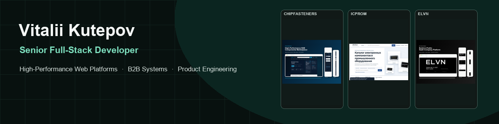
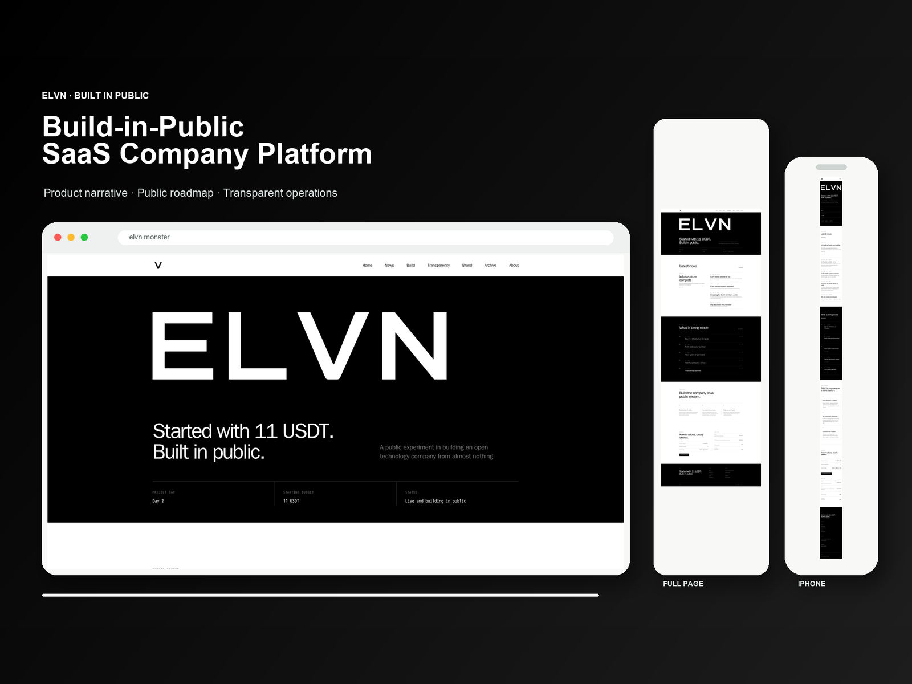
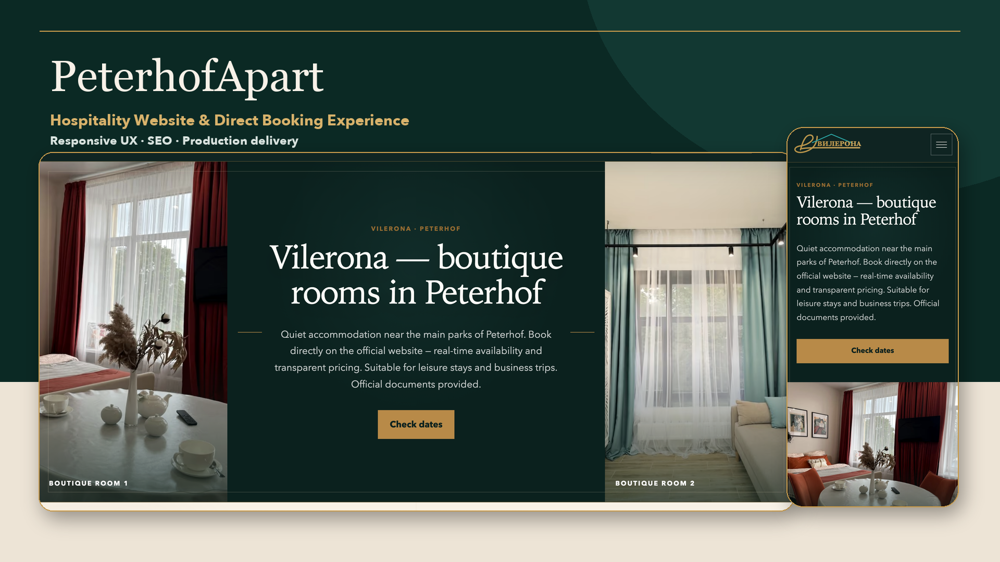

# Vitalii Kutepov

## Senior Full-Stack Developer | AI-Ready Products & High-Performance Web Platforms

I build scalable web platforms, B2B catalog systems, interactive products, and high-performance business websites from architecture to production.

My work spans full-stack product development, large B2B platforms, SaaS and web applications, technical SEO, responsive UX, accessibility, performance engineering, and secure production deployment. I work across Next.js, React, TypeScript, PHP, Node.js, Linux, Nginx, Docker, and relational data systems.

AI is described precisely in this portfolio: deployed integrations are separated from provider-agnostic architecture, AI-assisted development workflows, and deterministic product previews. No featured project is presented as a live AI service without production evidence.

[Featured projects](#featured-projects) · [Skills](docs/skills.md) · [Services](docs/services.md) · [Engineering principles](docs/engineering-principles.md) · [AI development](docs/ai-development.md) · [Contact](docs/contact.md)

## What I Build

- full-stack SaaS and web applications
- large B2B catalogs and procurement workflows
- multilingual, responsive products
- canonical, crawl-stable technical SEO architecture
- accessible interfaces and interaction systems
- performance-oriented server and data runtimes
- secure Linux, Nginx, and Docker deployments

## Featured Projects

### ChipFasteners

**High-performance B2B electronic components procurement platform.**

- **Live:** [chipfasteners.com](https://chipfasteners.com)
- **Business context:** component buyers need exact part-number discovery, manufacturer/family navigation, BOM intake, and an RFQ-first path.
- **Core challenge:** serve approximately 88,000 canonical product pages without making catalog parsing, memory use, or crawl behavior unpredictable.
- **Solution:** generated immutable catalog artifacts, page-ready data slices, canonical route architecture, structured data, secure public forms, and monitored releases.
- **My role:** senior full-stack and product engineering across architecture, public UX, performance, SEO, forms, validation, and deployment.
- **Verified scale:** approximately 88,000 canonical product routes in the documented catalog build.
- **Key technologies:** PHP, JavaScript, HTML, CSS, SQL, JSON-LD, Linux, Nginx, Playwright.
- **Case study:** [Read the ChipFasteners engineering case study](projects/chipfasteners.md).

### ICPROM

**Large-scale industrial components catalog and SEO runtime.**

- **Live:** [icprom.ru](https://icprom.ru)
- **Business context:** industrial buyers navigate electronic components, automation equipment, manufacturers, categories, MPNs, and OEM numbers.
- **Core challenge:** keep a deep PHP/MySQL catalog fast and crawl-stable while preserving established SEO contracts.
- **Solution:** immutable generated runtime artifacts for product slices, breadcrumbs, facets, summaries, and bounded request-time reads.
- **My role:** senior full-stack and product engineering across runtime architecture, response-time work, technical SEO, UX, and release verification.
- **Verified scale:** approximately 89,000 products in the catalog dataset documented for this runtime.
- **Key technologies:** PHP, MySQL/MariaDB, SQL, JavaScript, HTML, CSS, JSON-LD, Linux, Nginx.
- **Case study:** [Read the ICPROM engineering case study](projects/icprom.md).

### ELVN

**Secure public product-building and transparency platform.**

- **Live:** [elvn.monster](https://elvn.monster)
- **Business context:** a public build journal, news stream, transparency ledger, and brand archive need to remain readable, portable, and indexable.
- **Core challenge:** combine Markdown publishing, public records, privacy controls, responsive identity, and production security.
- **Solution:** semantic server-rendered routes, RSS and sitemap generation, consent controls, tested Docker deployment, read-only filesystem, and rollback procedures.
- **My role:** senior full-stack and product engineering across information architecture, implementation, SEO, privacy, tests, and deployment.
- **Verified result:** journal, news, ledger, archive, RSS, and sitemap are delivered as public, indexable product surfaces.
- **Key technologies:** Next.js, React, TypeScript, Node.js, Markdown, Docker, Linux, Nginx.
- **Case study:** [Read the ELVN engineering case study](projects/elvn.md).

### ARMSENS Academy

**Multilingual interactive electronics learning product.**

- **Live:** [academy.armsens.com](https://academy.armsens.com)
- **Business context:** learners need guided electronics lessons that work across languages, devices, keyboard input, and motion preferences.
- **Core challenge:** make interactive teaching behavior accessible, deterministic, testable, and ready for a future provider integration.
- **Solution:** five guided missions, seven-language product structure, teaching-mode controls, accessible focus states, reduced motion, tests, and a provider-agnostic tutor boundary.
- **My role:** senior full-stack and product engineering across multilingual architecture, React UX, accessibility, validation, testing, and build design.
- **Verified scale:** seven supported languages and five interactive electronics missions.
- **Key technologies:** Next.js, React, TypeScript, Node.js, Tailwind CSS, Prisma, Zod, Vitest.
- **AI status:** the documented tutor preview is deterministic; it is not claimed as a live LLM service.
- **Case study:** [Read the ARMSENS Academy engineering case study](projects/armsens-academy.md).

### PeterhofApart

**Hospitality website and direct booking experience.**

- **Live:** [peterhofapart.ru](https://peterhofapart.ru)
- **Business context:** guests need to compare accommodation, inspect rooms on mobile, find practical details, and move into a direct booking or contact journey.
- **Core challenge:** balance visual storytelling, responsive media, third-party widgets, performance, and technical SEO.
- **Solution:** statically generated accommodation pages, responsive imagery, explicit booking/contact paths, sitemap output, and resilient integration loading states.
- **My role:** senior full-stack and product engineering across architecture, responsive implementation, image performance, SEO, integrations, and deployment.
- **Verified result:** public room, apartment, location, contact, and booking journeys are represented across desktop and mobile screenshots.
- **Key technologies:** Astro, TypeScript, JavaScript, HTML, CSS, Sharp, static generation, sitemap tooling, HTTPS.
- **Case study:** [Read the PeterhofApart engineering case study](projects/peterhofapart.md).

## AI Capability, Stated Clearly

| Capability | Portfolio status |
| --- | --- |
| Deployed AI integrations | None claimed without separate production verification |
| Provider-agnostic AI-ready architecture | Demonstrated by the ARMSENS Academy tutor boundary |
| Deterministic product preview | Used to make tutor UX testable without implying a live model call |
| AI-assisted development | OpenAI Codex used with source verification, tests, visual QA, and security review |
| ELVN as a live AI product | Not claimed |

Read the full [AI development position](docs/ai-development.md).

## Engineering Approach

- measure a named signal instead of using vague optimization language
- preserve canonical URLs, metadata, and crawl contracts
- design accessibility into structure and interaction
- move expensive work out of public request paths
- keep releases observable and rollback documented
- distinguish prototypes, previews, integrations, and production services
- use AI as an engineering tool, never as a substitute for validation

## Services

Available for selected freelance, contract, and product engineering engagements involving:

- high-performance business websites
- B2B catalogs and procurement platforms
- SaaS and MVP development
- AI-ready product architecture
- technical SEO and crawl optimization
- performance and Core Web Vitals engineering
- production deployment and infrastructure
- multilingual web products

See [services and example fit](docs/services.md).

## Contact

Available for selected freelance, contract, and product engineering engagements.

Start with the [GitHub profile](https://github.com/elvn11ask) or review the approved channels in [docs/contact.md](docs/contact.md). No private phone number or unapproved contact detail is published in this repository.

## Repository Notes

This is a portfolio, not a source-code dump. It contains public project information, sanitized architecture descriptions, approved screenshots, and evidence-bounded claims. Proprietary source code, credentials, customer information, private infrastructure, analytics identifiers, and internal business data are intentionally excluded.
