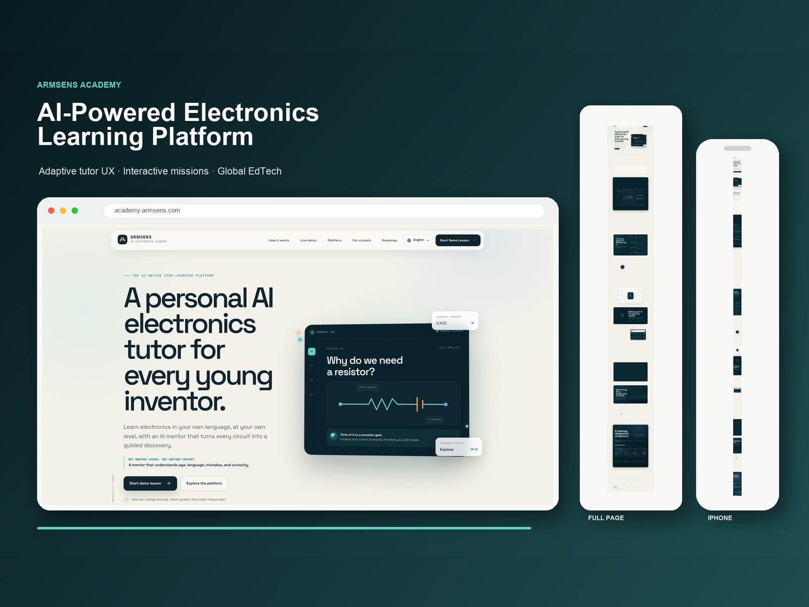
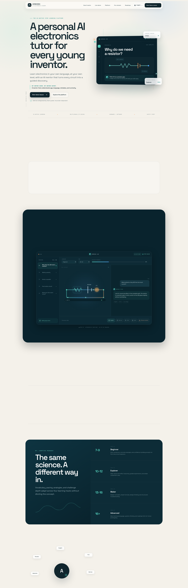
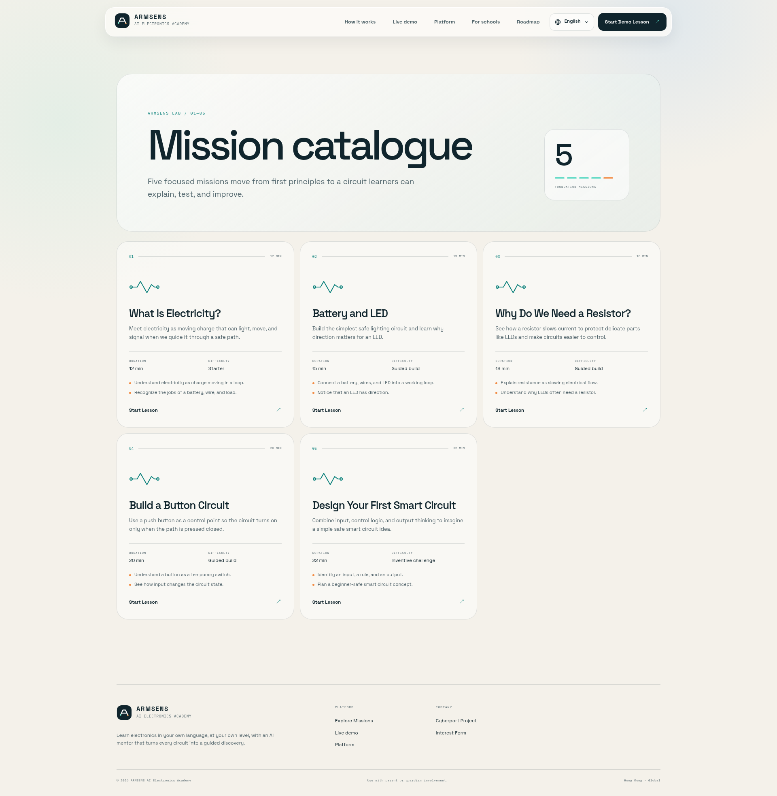
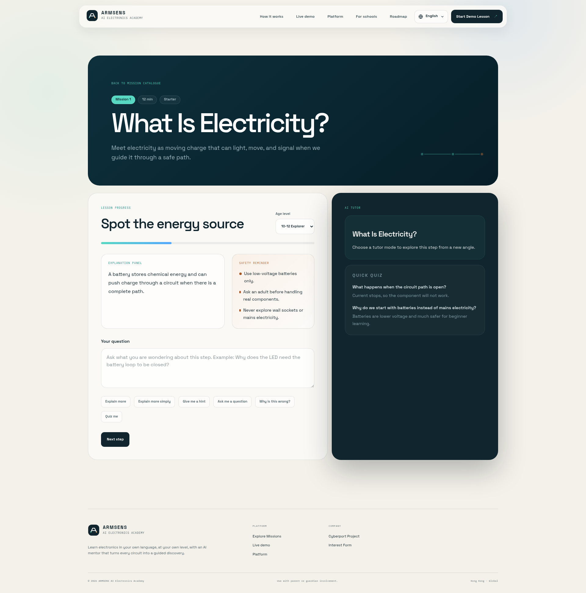

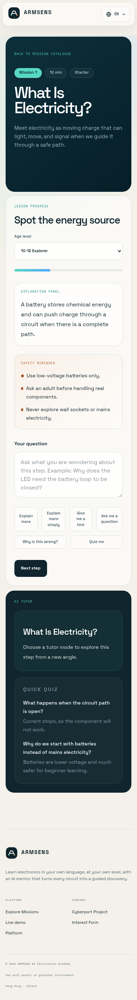

# ARMSENS Academy

## Overview

Multilingual interactive electronics learning product with five guided missions and seven supported languages.

## Business Context

Learners need a responsive, approachable way to move from electronics concepts to guided interactive exercises across languages and device sizes.

## Challenge

Build interactive teaching controls that remain accessible, predictable, testable, and safe while leaving a clean integration boundary for a future tutor provider.

## Solution

The product delivers five deterministic electronics missions, seven-language navigation, teaching-mode controls, responsive lesson views, accessible focus states, and reduced-motion support.

## Architecture

- Next.js and React application written in TypeScript
- schema validation with Zod
- static production build
- automated component and interaction tests
- provider-agnostic tutor boundary
- deterministic preview behavior when no live model provider is connected

## My Role

Senior Full-Stack Developer and Product Engineer across multilingual product architecture, interactive UX, accessibility, validation, automated tests, and production build design.

## Key Features

- seven supported languages
- five interactive electronics missions
- responsive mission and lesson interfaces
- teaching-mode controls
- visible keyboard focus states
- reduced-motion support

## Engineering Highlights

Tutor-related UI is separated from provider-specific behavior. The portfolio preview uses deterministic, bounded responses so the learning flow can be demonstrated and tested without implying a live LLM service.

## Performance and Quality

Quality gates cover linting, TypeScript validation, automated tests, and the static production build. The static delivery model keeps public lesson rendering independent of a model provider.

## Technical SEO

Server-rendered or statically generated learning routes, explicit language structure, metadata, and semantic page content support discovery without hiding lesson context behind a chat interface.

## Accessibility

Visible focus states, semantic controls, reduced-motion behavior, keyboard interaction, and responsive layouts are part of the teaching experience rather than post-release additions.

## Security and Deployment

The public preview does not require a live LLM credential. Provider connections, if added, can remain server-side behind validated boundaries without exposing secrets to the browser.

## Technologies

Next.js, React, TypeScript, Node.js, Tailwind CSS, Prisma, Zod, Vitest, and static production builds.

## Skills Demonstrated

Multilingual product development, interactive React UX, accessibility, test automation, schema validation, static delivery, and provider-agnostic AI-ready architecture.

## Screenshots

## Live Project

[academy.armsens.com](https://academy.armsens.com)

## Verification Notes

Seven languages and five missions are product counts, not usage metrics. The tutor preview is deterministic and is not presented as a live LLM service unless a production provider connection is independently verified.
