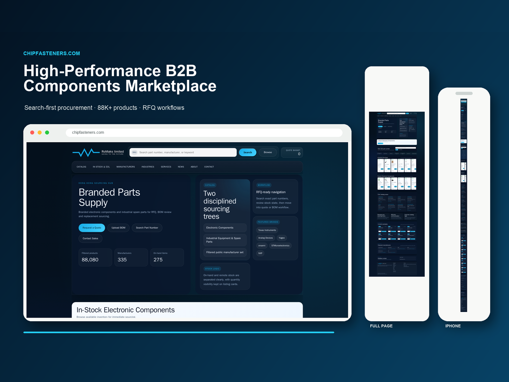
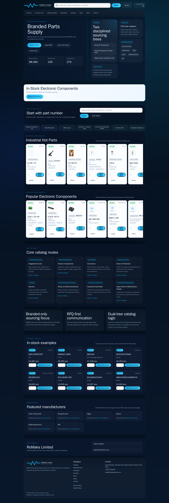
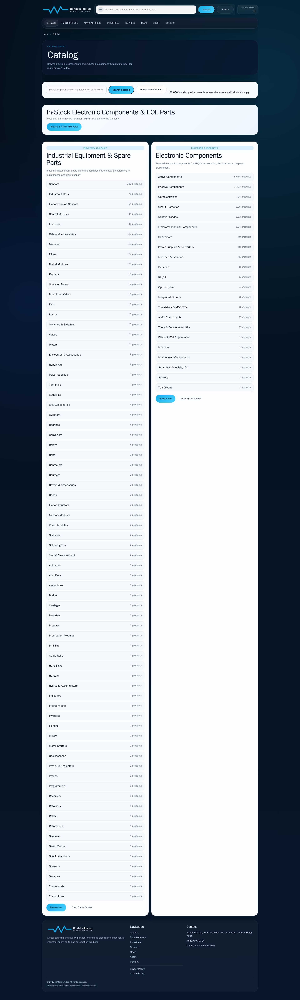
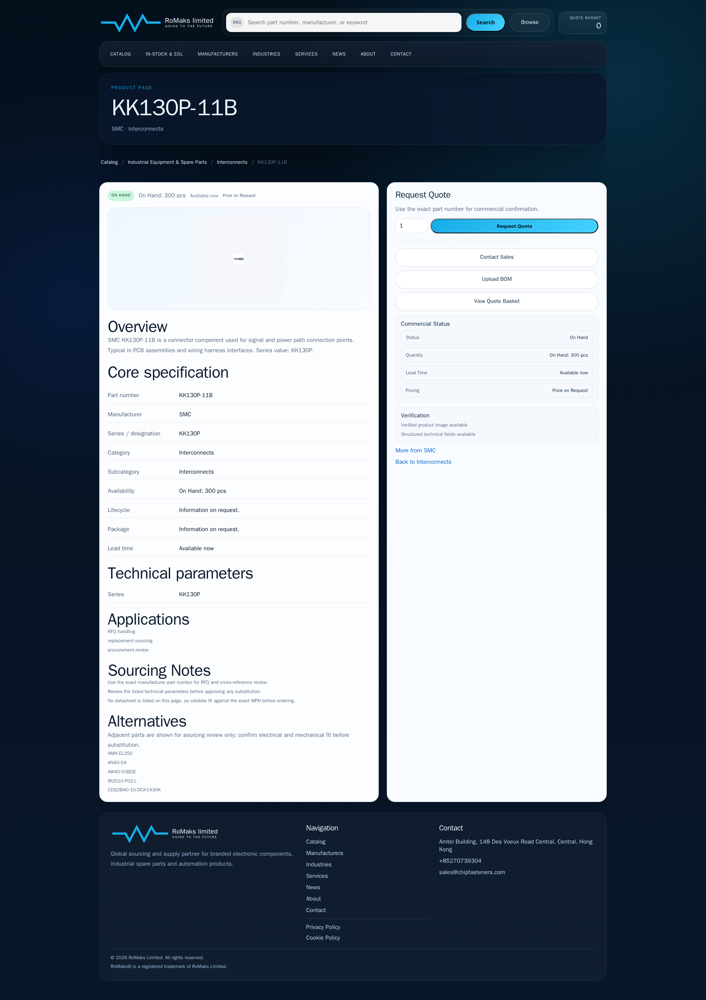

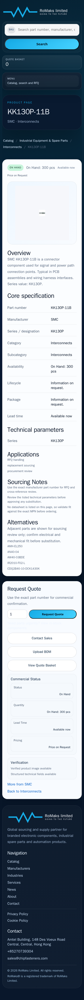
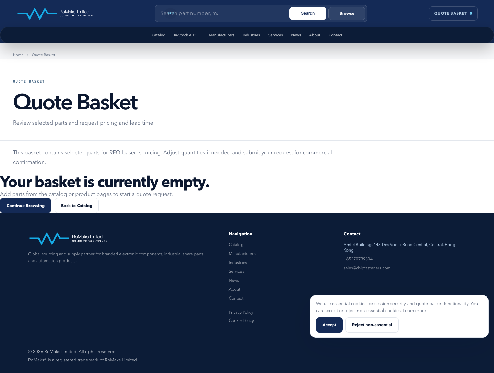

# ChipFasteners

## Overview

High-performance B2B electronic components procurement platform with catalog discovery, manufacturer navigation, and RFQ-first workflows.

## Business Context

Buyers need to move from an exact part number, manufacturer, or component family to a quote request without treating a technical catalog like a consumer storefront.

## Challenge

Serve approximately 88,000 canonical product pages while keeping catalog navigation, public forms, crawl behavior, runtime memory, and operational releases predictable.

## Solution

The platform combines manufacturer and family navigation with part-number search, BOM upload, a quote basket, and RFQ submission. Precomputed immutable data artifacts move expensive catalog preparation out of the public request path.

## Architecture

- PHP production runtime backed by generated catalog artifacts
- canonical product, manufacturer, and family routes
- precomputed indexes and page-ready catalog slices
- public RFQ and BOM workflows separated from catalog reads
- structured release, monitoring, and rollback procedures

## My Role

Senior Full-Stack Developer and Product Engineer across catalog architecture, public UX, technical SEO, performance work, secure forms, production validation, and deployment operations.

## Key Features

- approximately 88,000 canonical product pages
- manufacturer and component-family navigation
- exact part-number search
- BOM upload and quote basket
- RFQ-first procurement journey
- structured data and sitemap coverage

## Engineering Highlights

Catalog data is built into immutable, precomputed artifacts so public requests do not repeatedly parse or aggregate the full source dataset. Page-specific slices reduce request-time work and memory pressure.

## Performance and Quality

Work included request-path profiling, runtime and memory optimization, production telemetry, smoke tests, and release verification. No performance score is published here because a comparable public audit artifact is not included in this repository.

## Technical SEO

Canonical URL contracts, structured data, sitemaps, manufacturer/family hierarchy, and crawl-stable product routes are treated as part of the application architecture.

## Accessibility

Responsive layouts, semantic page structure, labeled controls, and keyboard-visible form interactions support procurement work across desktop and mobile views.

## Security and Deployment

Public forms use validation and abuse-resistant handling. Production work includes Linux, Nginx, monitored releases, and documented rollback without exposing infrastructure identifiers.

## Technologies

PHP, JavaScript, HTML, CSS, SQL, JSON-LD, Linux, Nginx, and automated browser testing.

## Skills Demonstrated

B2B catalog architecture, performance engineering, technical SEO, secure public workflows, responsive UX, production operations, and evidence-based release validation.

## Screenshots

## Live Project

[chipfasteners.com](https://chipfasteners.com)

## Verification Notes

The approximate page count refers to canonical product routes in the verified catalog build materials. Screenshots show public production interfaces. Private source code, supplier data, customer records, server details, and internal telemetry are excluded.

