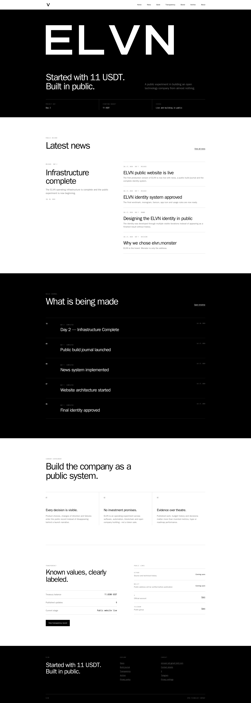
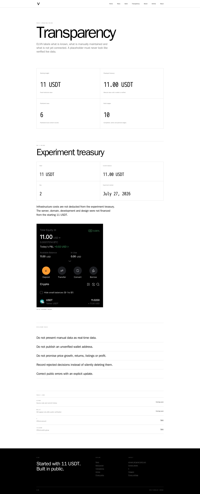
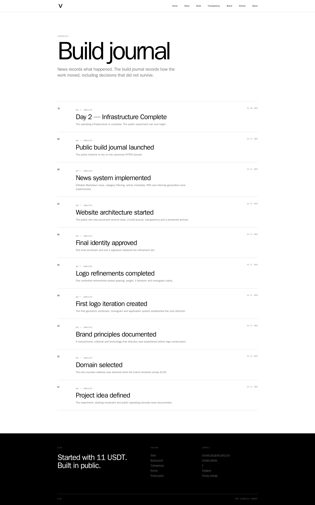
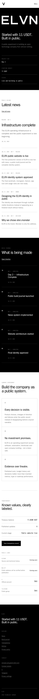
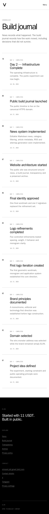

# ELVN

## Overview

Secure, public product-building and transparency platform implemented as a semantic, indexable Next.js application.

## Business Context

ELVN documents a product-building process in public through a build journal, news, a transparency ledger, and a brand archive.

## Challenge

Combine editorial Markdown content, verifiable public records, privacy controls, and a distinctive responsive identity without turning the site into an opaque client-only application.

## Solution

Server-rendered routes expose journal, news, ledger, and archive content with RSS and sitemap outputs. Privacy and consent controls are integrated into the public experience.

## Architecture

- Next.js and React application written in TypeScript
- Markdown content parsed into server-rendered pages
- RSS and sitemap generation
- Docker deployment behind Nginx
- read-only application filesystem in production
- tested release and rollback process

## My Role

Senior Full-Stack Developer and Product Engineer across information architecture, implementation, responsive UX, technical SEO, privacy controls, test automation, and production deployment.

## Key Features

- build journal and news publishing
- transparency ledger
- brand archive
- Markdown content pipeline
- RSS and sitemap
- consent and privacy controls

## Engineering Highlights

Content stays portable and reviewable in Markdown while the runtime provides semantic routes and structured publishing outputs. The production container is designed for a read-only filesystem and explicit rollback.

## Performance and Quality

Validation includes linting, TypeScript checks, automated tests, production builds, and release smoke testing. No synthetic score is claimed without a repository audit artifact.

## Technical SEO

Server-rendered content, semantic navigation, metadata, RSS, and sitemap output make the public record indexable without requiring client-side execution.

## Accessibility

The responsive implementation uses semantic landmarks, structured headings, readable contrast, keyboard-operable navigation, and content that remains available without animation.

## Security and Deployment

Docker and Nginx deployment uses a read-only application filesystem, explicit health verification, monitored release steps, and a documented rollback path.

## Technologies

Next.js, React, TypeScript, Node.js, Markdown, Docker, Linux, and Nginx.

## Skills Demonstrated

Full-stack product development, content architecture, technical SEO, privacy-conscious UX, responsive implementation, automated quality gates, and secure deployment.

## Screenshots

## Live Project

[elvn.monster](https://elvn.monster)

## Verification Notes

ELVN is not described here as a deployed AI product because no live AI feature is asserted by the approved portfolio evidence. Public pages and approved screenshots are included; private deployment details are not.

