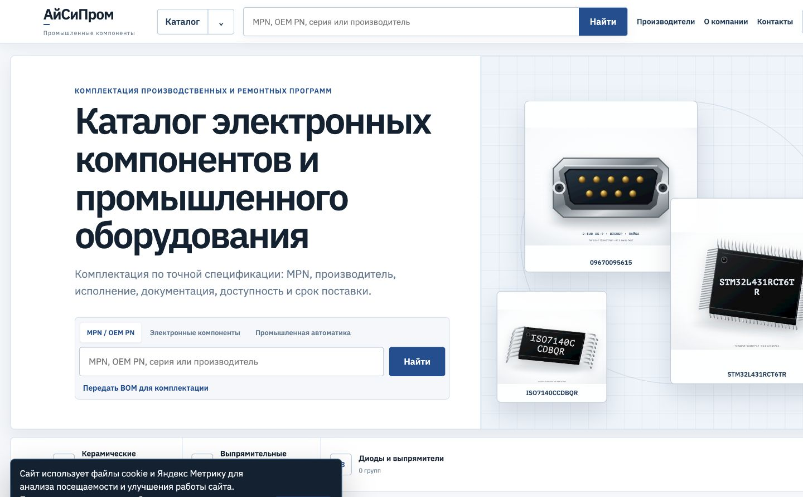
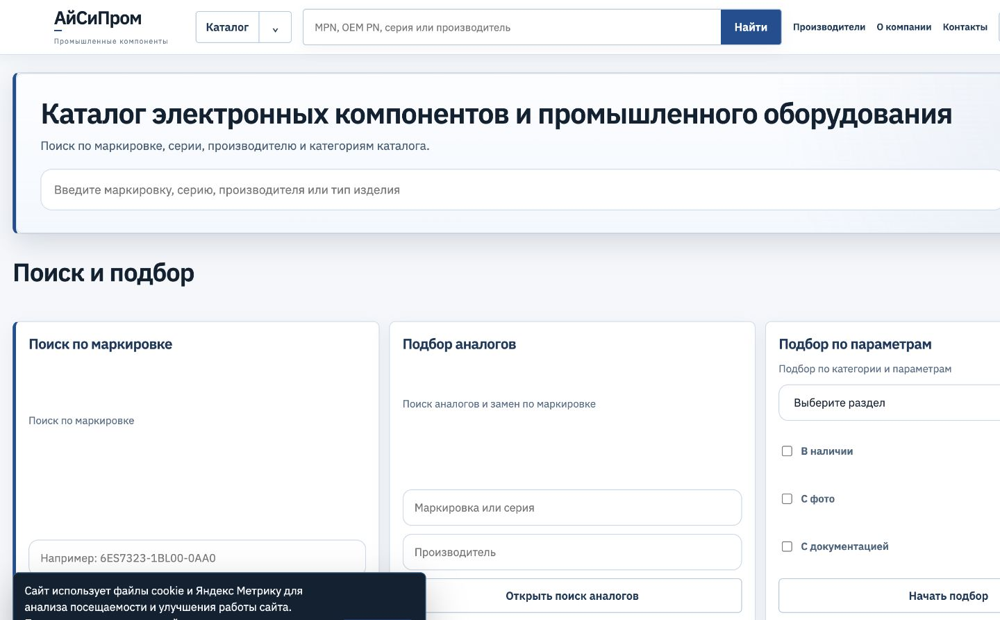
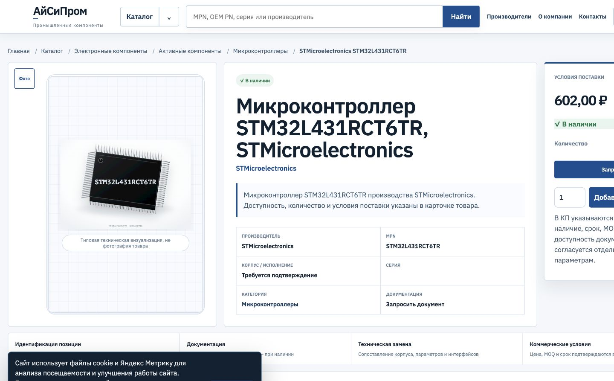
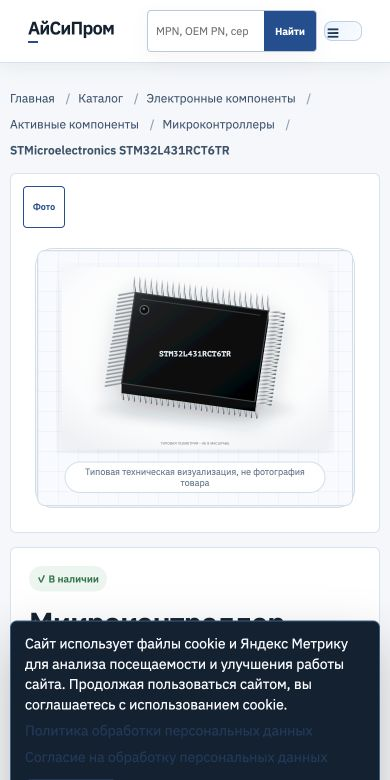
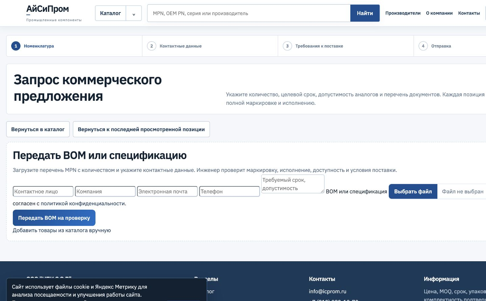

# ICPROM

## Overview

Large-scale industrial components catalog and SEO runtime for electronic components, automation equipment, and spare parts.

## Business Context

Industrial buyers search by MPN, OEM number, manufacturer, category, and technical context. The catalog must remain useful to people and crawlable at product scale.

## Challenge

Operate a PHP/MySQL catalog of approximately 89,000 products with deep category and manufacturer structures while preserving established URLs and stable crawler response behavior.

## Solution

Generated runtime artifacts prepare page slices, breadcrumbs, facets, and catalog summaries ahead of public requests. The production runtime reads bounded data instead of rebuilding the complete catalog model on each page view.

## Architecture

- PHP/MySQL application behind Nginx
- immutable generated runtime artifacts
- page-specific product and category slices
- precomputed breadcrumb, facet, and summary data
- stable canonical routes and sitemap coverage

## My Role

Senior Full-Stack Developer and Product Engineer responsible for catalog runtime architecture, response-time work, SEO preservation, public UX, deployment validation, and production crawl stability.

## Key Features

- approximately 89,000 catalog products in the documented dataset
- category and manufacturer navigation
- MPN and OEM-number search
- product detail pages and availability presentation
- BOM and request-for-quote journey
- responsive catalog views

## Engineering Highlights

The generated-artifact approach separates heavy catalog preparation from request handling. Breadcrumbs, facets, summaries, and bounded page data can be published atomically and rolled back as a known release unit.

## Performance and Quality

Response-time optimization focused on bounded reads, memory use, and crawl stability under large route sets. This case study does not publish an unverified percentile, Lighthouse score, or crawler throughput number.

## Technical SEO

Existing canonical URLs, category relationships, metadata, sitemaps, and indexable server-rendered content are preserved as explicit compatibility contracts.

## Accessibility

The responsive interface uses semantic headings, labeled search and RFQ controls, readable tables, and mobile alternatives for dense catalog information.

## Security and Deployment

The public application is deployed over HTTPS behind Nginx. Operational descriptions are intentionally sanitized; no internal hosts, addresses, credentials, or database details are published.

## Technologies

PHP, MySQL/MariaDB, SQL, JavaScript, HTML, CSS, JSON-LD, Linux, and Nginx.

## Skills Demonstrated

Large-catalog architecture, immutable data publishing, PHP performance, technical SEO, crawl optimization, responsive B2B UX, and safe production releases.

## Screenshots

## Live Project

[icprom.ru](https://icprom.ru)

## Verification Notes

The approximate product count refers to the verified catalog dataset documented for this runtime, not a claim about daily stock availability. Screenshots were captured from the public production site. Internal infrastructure and business data are excluded.
