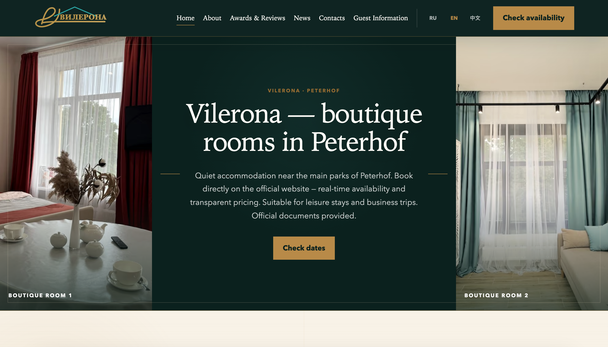
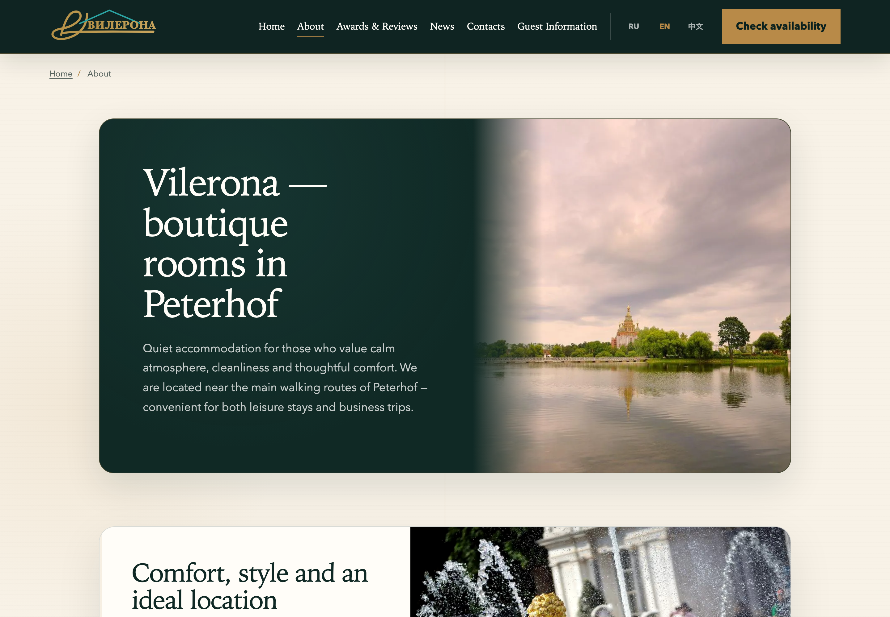
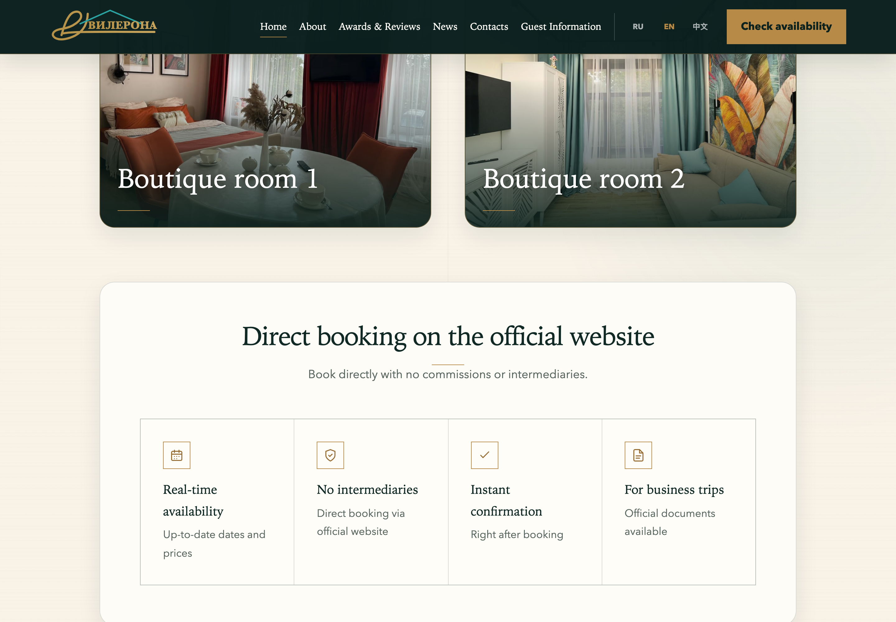

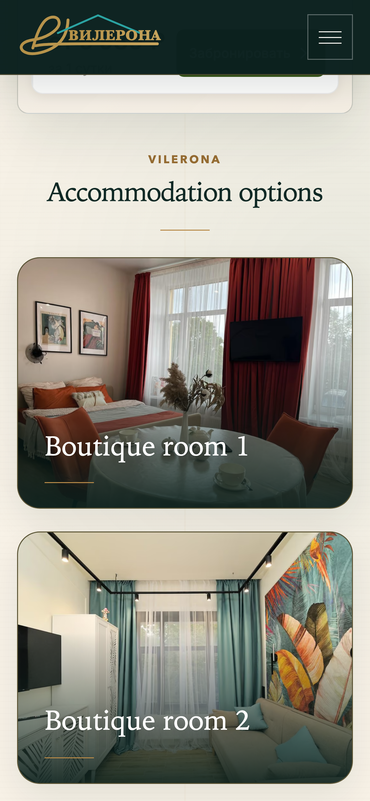

# PeterhofApart

## Overview

Hospitality website and direct booking experience for rooms and apartments in Peterhof.

## Business Context

Prospective guests need to understand accommodation options, inspect rooms on mobile, check practical details, and move into a direct booking or contact journey.

## Challenge

Balance visual storytelling, detailed room presentation, third-party booking and map integrations, responsive performance, and search visibility.

## Solution

The site provides accommodation listings, room detail pages, clear booking and contact paths, location information, responsive media, and deliberate loading states around third-party services.

## Architecture

- statically generated Astro site
- TypeScript build and validation tooling
- optimized image pipeline
- sitemap generation
- third-party booking, map, and communication integrations
- HTTPS production delivery

## My Role

Senior Full-Stack Developer and Product Engineer across information architecture, responsive implementation, image performance, technical SEO, integrations, release verification, and production deployment.

## Key Features

- accommodation listing and detail pages
- room and apartment presentation
- direct booking or contact journey
- responsive mobile experience
- map and communication integrations
- third-party widget loading states

## Engineering Highlights

Static generation keeps primary hospitality content fast and indexable while third-party services are treated as progressive integrations with explicit loading and failure states.

## Performance and Quality

Work includes responsive image preparation, static output validation, loading-state handling, and production checks.

## Technical SEO

Indexable accommodation pages, metadata, sitemap output, meaningful headings, and stable public URLs support search discovery for the property and its room types.

## Accessibility

Responsive typography, meaningful image alternatives, keyboard-visible controls, structured content, and readable booking actions support mobile and desktop journeys.

## Security and Deployment

The public site uses production HTTPS. Third-party integrations are isolated from primary content so external availability does not remove core property information.

## Technologies

Astro, TypeScript, JavaScript, HTML, CSS, Sharp, static generation, sitemap tooling, and HTTPS deployment.

## Skills Demonstrated

Hospitality UX, responsive design, visual content engineering, technical SEO, third-party integration, static-site performance, and production release validation.

## Screenshots

## Live Project

[peterhofapart.ru](https://peterhofapart.ru)
